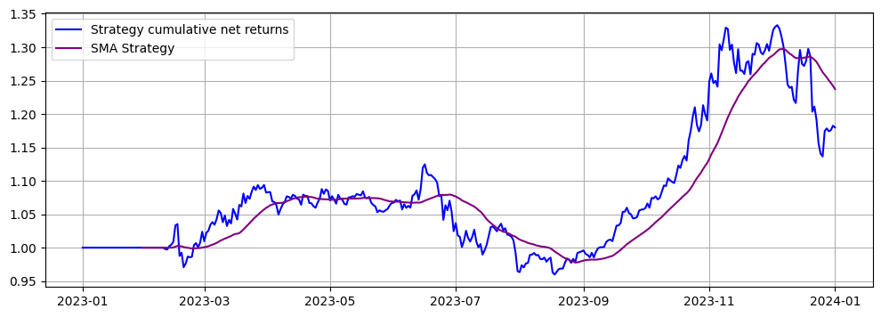
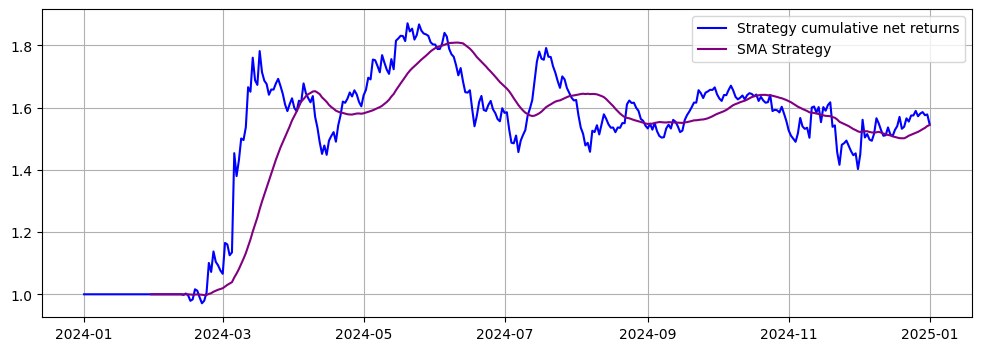
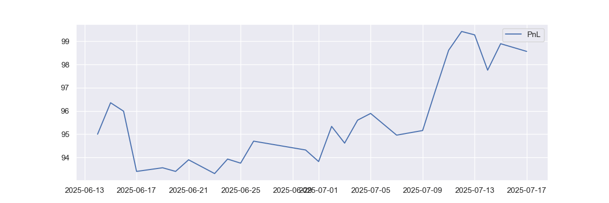

# Crypto Pair Trading Backtest 

This repository contains Jupyter Notebooks for backtesting a **pair trading strategy** on cryptocurrencies, **including exchange fees**, evaluated over two distinct time periods. 

## Contents

### Backtest Notebooks

1. **`period_1_backtest.ipynb`**
   - **In-sample period**: 2021-01-01 to 2022-12-31  
   - **Out-of-sample backtest**: 2023-01-01 to 2024-01-01

2. **`period_2_backtest.ipynb`**
   - **In-sample period**: 2022-01-01 to 2023-12-31  
   - **Out-of-sample backtest**: 2024-01-01 to 2025-01-01

Each notebook identifies candidate trading pairs using statistical techniques and evaluates performance with plotted metrics and trade visualizations.

---

## Strategy Overview

The strategy involves identifying and trading mean-reverting crypto pairs based on the following process:

1. **Universe Selection**  
   A predefined list of cryptocurrencies is used.

2. **OLS Regression & Filtering**  
   - For each candidate pair, an OLS regression is performed in the in-sample period.
   - Pairs with **R² ≥ 0.9** are retained for further analysis.

3. **Rolling Spread & Stationarity Check**  
   - A rolling spread is constructed for each selected pair.
   - The **Augmented Dickey-Fuller (ADF) test** is applied to check for mean-reversion.
   - Pairs yielding an **ADF p‑value < 0.05** are flagged for further inspection
   - The selected pairs are visually inspected to assess the behavior and stability of their spreads, confirming their suitability for trading.

4. **Uniqueness Constraint**  
   - To avoid overlapping exposure, if a coin appears in multiple valid pairs, only the pair with the **lowest ADF statistic** is selected.

---

## Backtest Results (fees included)

### Period 1 (2023-01-01 to 2024-01-01)
- **Traded Pairs**:  
  - **BTC / DOT**  
  - **AAVE / UNI**
 

### Period 2 (2024-01-01 to 2025-01-01)
- **Traded Pairs**:  
  - **NEAR / ADA**  
  - **VET / DOT**
    

## Live trading results (Position closed on 15.07.25):
- **Traded Pairs**:  
  - **ETH / UNI**

  

   
