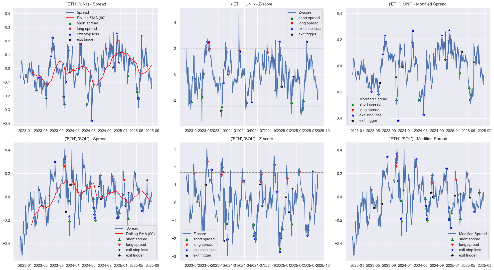

# Crypto Pairs Trading Strategy

This repository contains a Python implementation for backtesting a pairs trading strategy based on z-score signals, mean reversion, and stop-loss logic. It includes reusable functions for running the backtest and visualizing cumulative realized portfolio value over time. 

---

## Feautures

1. Backtest multiple asset pairs with configurable stop-loss, capital allocation, and fees.

2. Dynamic position sizing.

3. Entry and exit logic based on turning points and mean-reversion in z-scores.

4. Tracking of unrealized and realized profit & loss and fees.

5. Plot cumulative portfolio value for each pair.

## Files

1. **functions.py**: Contains functions to fetch price data from an exchange (e.g Binance), signal generation and backtesting.
2. **backtest.ipynb**: Example notebook for running backtest and plotting with sample data.

## Strategy Overview

This strategy trades mean-reverting cryptocurrency pairs using the following approach:

1. **Spread Construction and Z-score Calculation:**
The spread between two assets is computed over a rolling 90-day window, and its z-score is derived for entry signal generations.

2. **Entry Signal Generation:**
Entry signals are generated based on z-score threshold crossovers, where thresholds are chosen to capture *rare or extreme values* that the z-score reaches. These thresholds are manually selected per pair, focusing on points where the spread significantly deviates from its historical behavior. For example, backtests are performed on pairs like ETH-SOL and ETH-UNI.

3. **Smoothed Reversion Confirmation:**
After a signal crossover, the strategy waits for a “smoothed” reversion using an exponentially weighted moving average (EWM). Trades are entered when a change in the derivative of this smoothed z-score indicates a turning point.

4. **Trade Management and Exit Criteria:**
Upon entering a trade, beta and alpha parameters are fixed for the trade duration. The strategy exits the trade either when a 3% stop loss on the initial notional is hit or when the “fixed” z-score—calculated using the spread, fixed alpha, beta, and rolling mean and standard deviation from the entry period—signals mean reversion.

---

## Backtest Results (fees included)

- **Backtested Pairs**:  
  - **ETH / SOL**  
  - **ETH / UNI**
 

## Live trading results:
- **Traded Pairs**:  
  - **ETH / UNI (14.06.2025 - 15.07.25 - closed as reverted)**

  

   
